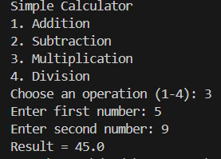

# Simple Java Calculator

A beginner-friendly console calculator built using Java.

## Features
- Addition
- Subtraction
- Multiplication
- Division

## Technologies Used
- Java
- Scanner class

## Output Screenshot

## Author

Deepak  
Java Beginner | Student Developer